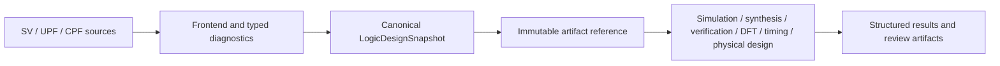

# LogicDesign

Canonical digital design state, SystemVerilog frontend and power-intent contracts for a local semiconductor design platform.

## Status

This package provides a native, deterministic subset implementation for canonical RTL and power-intent state. It is designed for both human workflows and structured Agent workflows through typed Swift APIs, immutable artifacts and a deterministic JSON CLI.

The implementation is intentionally explicit about its qualification boundary: unsupported language semantics return structured blocked results, while native parser success does not claim full-language, external-oracle or process-specific qualification.

## Products

| Product | Responsibility |
|---|---|
| `LogicIR` | Stable RTL/gate identity, source provenance, snapshots and validation |
| `SystemVerilogFrontend` | Lexing, parsing, parameter evaluation, relative include resolution and canonical RTL elaboration subset |
| `PowerIntent` | UPF/CPF domain and low-power policy parsing/validation subset |
| `LogicDesign` | Umbrella API |
| `logic-design` | Deterministic JSON CLI for parse, validate, gate-parse, power-intent and capability inspection |

## Design flow



## Native capability

- Stable RTL and gate identities, source locations and source-file SHA-256 provenance.
- Canonical JSON snapshots with schema validation, deterministic digesting and tamper detection.
- Transformation-aware `LogicDesignReference` lineage preserves the original canonical digest, immediate input digest, transformation ID, producer version and run ID across engine handoffs.
- ANSI SystemVerilog modules, parameters, numeric object-like macros, constant expressions, vectors, memories, assignments, supported processes and hierarchy.
- Project-relative `` `include `` graph resolution through an injected source provider. Malformed, missing and cyclic includes produce typed diagnostics.
- Constant `generate-for` and `generate-if/else` elaboration, structural gate netlist parsing and connectivity validation.
- UPF/CPF domain, supply-set, isolation, level-shifter and retention policy modeling within the native subset.
- Retained positive and negative fixtures in `Fixtures/manifest.json`, including SHA-256 integrity and expected native status.

## Contract

Every executing product uses:

- a `Codable`, `Hashable`, `Sendable` request conforming to `XcircuiteEngineRequest`;
- `XcircuiteEngineResultEnvelope<Payload>` for status, diagnostics, artifacts and execution metadata;
- protocol-first dependency injection;
- immutable `XcircuiteFileReference` inputs and outputs;
- explicit blocked, failed and cancelled states.

## Xcircuite integration

Xcircuite treats `LogicDesignReference` and `PowerIntentReference` as canonical stage handoffs consumed by simulation, synthesis, verification, DFT, timing and physical design. The LogicDesign adapter resolves project-root-relative source includes, persists canonical snapshots and result envelopes, and applies an artifact-integrity gate.

The library does not depend on the Xcircuite runtime. Xcircuite owns the adapter to `DesignFlowKernel.FlowStageExecutor`, artifact persistence, qualification gates, repair loops and human approval.

## CLI

The CLI emits deterministic JSON for machine consumption. A successful operation exits with status `0`; invalid input, failed validation or blocked native semantics exits non-zero and includes structured diagnostics.

```bash
swift run logic-design capabilities
swift run logic-design parse --input Fixtures/positive/simple_counter.sv --top counter --output /tmp/counter.json
swift run logic-design gate-parse --input Fixtures/positive/simple_gate.v --top top
swift run logic-design power-intent --input Fixtures/power/sample.cpf --format cpf --top top --design-digest fixture
```

## Build and test

```bash
swift build
perl -e 'alarm 30; exec @ARGV' xcodebuild test -scheme LogicDesign-Package -destination 'platform=macOS'
```

The current contract suite passes with 32 tests in 5 suites. The retained fixture corpus is executed as part of that suite. The current Xcircuite integration regression passes with 505 tests in 54 suites, including LogicDesign, LogicEngine, DFT, PDK and physical-design adapter coverage.

## Qualification boundary

The native implementation is smoke-checked and deterministic. Full SystemVerilog, UPF and CPF language coverage, external-tool correlation, PDK/process qualification, release approval and human approval/resume orchestration are separate platform gates. See `CAPABILITIES.md`, `MILESTONES.md` and `GOAL_STATUS.md` for the current evidence and remaining gaps.

See `DESIGN.md`, `INTERFACES.md` and `IMPLEMENTATION_PLAN.md` before implementing a backend.

See `CAPABILITIES.md` for the qualification boundary and explicit blocked semantics.
