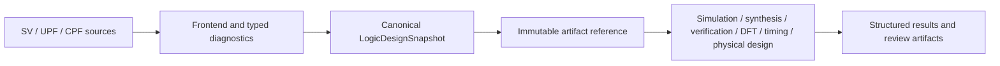
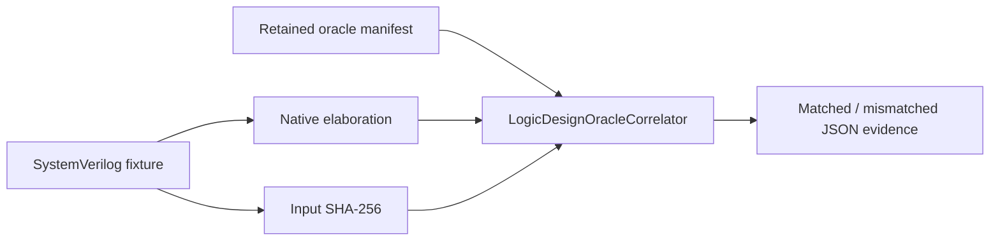

# LogicDesign

Canonical digital design state, SystemVerilog frontend and power-intent contracts for a local semiconductor design platform.

## Status

This package provides a native, deterministic subset implementation for canonical RTL and power-intent state. It is designed for both human workflows and structured Agent workflows through typed Swift APIs, immutable artifacts and a deterministic JSON CLI.

The implementation is intentionally explicit about its qualification boundary: unsupported language semantics return structured blocked results, while native parser success does not claim full-language, external-oracle or process-specific qualification.

## Products

| Product | Responsibility |
|---|---|
| `LogicIR` | Stable RTL/gate identity, source provenance, snapshots and validation |
| `SystemVerilogFrontend` | Lexing, parsing, parameter evaluation, relative include resolution and canonical RTL elaboration subset |
| `PowerIntent` | UPF/CPF domain and low-power policy parsing/validation subset |
| `LogicDesign` | Umbrella API |
| `logic-design` | Deterministic JSON CLI for parse, validate, gate-parse, power-intent, reference correlation and capability inspection |

## Design flow



Reference correlation is a separate, digest-bound evidence path:



## Native capability

- Stable RTL and gate identities, source locations and source-file SHA-256 provenance.
- Canonical JSON snapshots with schema validation, deterministic digesting and tamper detection.
- Transformation-aware `LogicDesignReference` lineage preserves the original canonical digest, immediate input digest, transformation ID, producer version and run ID across engine handoffs.
- ANSI SystemVerilog modules, parameters, numeric object-like macros, constant expressions, vectors, memories, assignments, supported processes and hierarchy.
- Instance parameter overrides are resolved per hierarchy context, including symbolic port/signal ranges and constant generate bounds.
- Clocked process event lists preserve source order and per-signal edge metadata, including asynchronous reset events, through hierarchy elaboration.
- Object-like numeric macro conditional compilation supports `ifdef`, `ifndef`, `elsif`, `else` and `endif`; unsupported preprocessor forms remain typed blocked results.
- Project-relative `` `include `` graph resolution through an injected source provider. Malformed, missing and cyclic includes produce typed diagnostics.
- Constant `generate-for` and `generate-if/else` elaboration, structural gate netlist parsing and connectivity validation.
- UPF/CPF domain, supply-set, isolation, level-shifter and retention policy modeling within the native subset.
- Retained positive and negative fixtures in `Fixtures/manifest.json`, including SHA-256 integrity and expected native status.
- A retained SystemVerilog reference corpus in `Fixtures/oracle/manifest.json`; its 13 cases bind source SHA-256, expected status, completed snapshot digests and negative diagnostic codes.
- Typed `LogicDesignOracleManifest`, `LogicDesignOracleCorrelator` and `LogicDesignOracleCorrelation` APIs for Agent/CI-readable comparison evidence.

## Contract

Every executing product uses:

- a `Codable`, `Hashable`, `Sendable` request conforming to `XcircuiteEngineRequest`;
- `XcircuiteEngineResultEnvelope<Payload>` for status, diagnostics, artifacts and execution metadata;
- protocol-first dependency injection;
- immutable `XcircuiteFileReference` inputs and outputs;
- explicit blocked, failed and cancelled states.

## Xcircuite integration

Xcircuite treats `LogicDesignReference` and `PowerIntentReference` as canonical stage handoffs consumed by simulation, synthesis, verification, DFT, timing and physical design. The LogicDesign adapter resolves project-root-relative source includes, persists canonical snapshots and result envelopes, and applies an artifact-integrity gate.

The library does not depend on the Xcircuite runtime. Xcircuite owns the adapter to `DesignFlowKernel.FlowStageExecutor`, artifact persistence, qualification gates, repair loops and human approval.

## CLI

The CLI emits deterministic JSON for machine consumption. A successful operation exits with status `0`; invalid input, failed validation or blocked native semantics exits non-zero and includes structured diagnostics.

```bash
swift run logic-design capabilities
swift run logic-design parse --input Fixtures/positive/simple_counter.sv --top counter --output /tmp/counter.json
swift run logic-design correlate --input Fixtures/positive/simple_counter.sv --oracle Fixtures/oracle/manifest.json --case simple-counter
swift run logic-design gate-parse --input Fixtures/positive/simple_gate.v --top top
swift run logic-design power-intent --input Fixtures/power/sample.cpf --format cpf --top top --design-digest fixture
```

## Build and test

```bash
swift build
perl -e 'alarm 30; exec @ARGV' xcodebuild test -scheme LogicDesign-Package -destination 'platform=macOS'
```

The current LogicDesign contract suite passes with 46 tests in 5 suites. The retained fixture corpus contains 15 native cases, and the separate reference manifest correlates all 13 SystemVerilog cases, including completed snapshot digests and typed negative diagnostics. This evidence is local reference correlation, not external-tool or process qualification. Parallel shared-workspace runs are not signoff evidence.

## Qualification boundary

The native implementation is smoke-checked and deterministic. Hierarchy flattening is implemented for connected identifier-based ports with instance parameter overrides, symbolic range resolution and contextual constant generate expansion; bidirectional ports, non-identifier outputs and unresolved parameter contexts return typed blocked diagnostics. The retained reference oracle is now correlated through a digest-bound typed API and CLI. Full SystemVerilog, UPF and CPF language coverage, external-tool correlation, PDK/process qualification, release approval and human approval/resume orchestration remain separate platform gates. See `CAPABILITIES.md`, `MILESTONES.md` and `GOAL_STATUS.md` for the current evidence and remaining gaps.

See `DESIGN.md`, `INTERFACES.md` and `IMPLEMENTATION_PLAN.md` before implementing a backend.

See `CAPABILITIES.md` for the qualification boundary and explicit blocked semantics.

## Current integration evidence

The retained LogicDesign reference correlation is available to Xcircuite/Agent callers as structured JSON input evidence. Xcircuite's independent external-oracle execution contract is separately focused-tested, while real external-tool correlation, PDK/process qualification and release-profile eligibility remain explicit gates.
